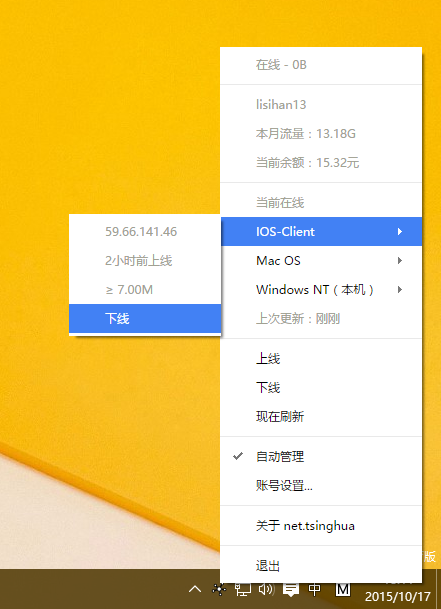
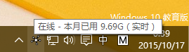

# net.tsinghua

清华大学自动联网助手

下载[最新版本](http://net-tsinghua.herokuapp.com)

Icon created by riyazali from the Noun Project.

## 简单，但又好用

当前状态，自动管理，手动操作，甚至管理其他链接…而这一切，都在一个小小的状态栏图标中。

## 就在你手边

当你不想用它时，干脆完全不理它吧。不过，一旦有任何新消息，它都会第一时间通知你，快速而有效。
谁想一遍遍点开浏览器上的 net.tsinghua.edu.cn 标签？

### 消息提醒

上线和下线的时候，会有消息提示你。

### 鼠标悬停

想快速知道现在的状态？鼠标放在图标上就行了！

## 永远崭新

谁想要一个死的 app？

任何更新都会被自动安装，而这一切完全是后台进行的。

安心吧，版本控们 —— 我们是一家人。

## 跨平台

在用 Mac？OS X 版本就是为你准备的。放心，所有功能都在，甚至包括自动更新。

## 开源

net.tsinghua 是一个开源项目，使用 MIT 许可证，这意味着你可以对它进行任何改进。

发现了 bug？想增加一个功能？
[提交 issue](https://github.com/ThomasLee969/net.tsinghua/issues/new) 或者
[发起 pull request](https://github.com/ThomasLee969/net.tsinghua/compare/)!
